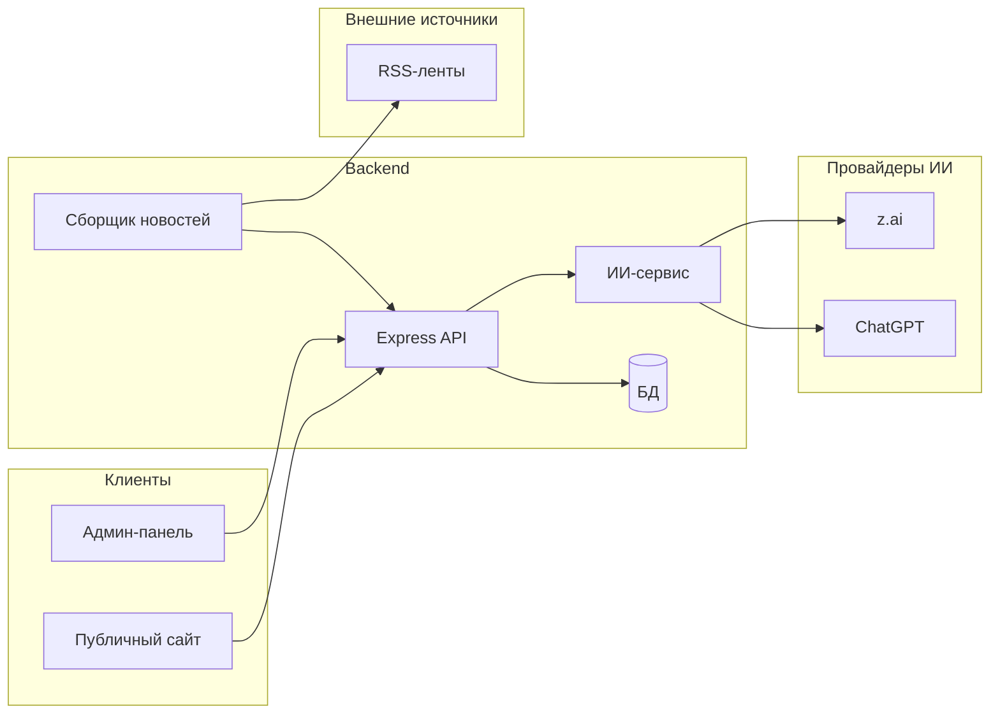

# План: Веб-приложение «Агрегатор новостей»

## Архитектура проекта

Рекомендуемая структура — **монорепозиторий** с тремя основными частями:

- **Backend** (Express.js) — REST API, сбор новостей, БД, авторизация админов.
- **Frontend** (Nuxt 3) — публичный сайт для чтения новостей (SSR или SSG).
- **Admin** (Vue 3 + Vite) — отдельное SPA в монорепо (папка `admin/`) с защитой по JWT.




---

## 1. Backend (Express.js)

### 1.1 Стек и структура

- **Runtime:** Node.js 20+
- **Фреймворк:** Express.js
- **БД:** PostgreSQL (реляционная модель для новостей, разделов, меню, пользователей) + Prisma или node-pg в качестве ORM/драйвера
- **Очереди:** Bull (Redis) — для фонового сбора новостей по расписанию и по запросу
- **Валидация:** Zod или Joi для входящих данных
- **Авторизация:** JWT (access + опционально refresh), bcrypt для паролей. Роли **editor** и **admin**: проверка роли в middleware — редактору доступны только операции с новостями, админу все настройки.

Структура каталогов backend:

```
backend/
  src/
    config/         # env, БД, Redis
    modules/
      auth/         # логин, JWT, middleware по ролям (requireAdmin, requireEditorOrAdmin)
      news/         # CRUD новостей, статусы, история, интеграция с ИИ (проверка фактов, генерация)
      sources/      # источники — только RSS-ленты, добавляются через админку
      sections/     # разделы сайта
      menu/         # меню: сущность Menu (несколько меню) и пункты MenuItem
      pages/        # статические страницы (контакты, информация и т.д.)
      users/        # админы (опционально роли)
    jobs/           # воркеры сбора новостей (по региону, тегу и т.д.)
    services/       # ИИ-сервис: обёртка над z.ai, OpenAI (ChatGPT) — проверка фактов, генерация текста
    app.js
    server.js
  prisma/           # миграции и схема (если Prisma)
```

### 1.2 Модели данных (ключевые сущности)

- **User** — id, email, passwordHash, role (admin/editor), createdAt
- **NewsItem** — id, sourceId, externalId, title, summary, body, url, imageUrl, region, publishedAt, status (pending/published/rejected), sectionId, createdAt, updatedAt
- **Source** — id, type (rss), url (URL ленты), name, params (JSON: регион, теги), isActive, lastFetchedAt. Источники — только RSS-ленты, добавляются через админку.
- **Section** — id, slug, title, description, order, isVisible
- **Menu** — id, key (уникальный идентификатор: header, footer, sidebar и т.д.), name (название для админки), description (опционально), order
- **MenuItem** — id, menuId, label, url (или sectionId), order, parentId
- **Page** — id, slug (уникальный), title, body (HTML), order, isVisible, createdAt, updatedAt. Контент хранится в HTML; на фронте при выводе через v-html обязательна санитизация.
- **NewsItemHistory** — id, newsItemId, userId, snapshot (JSON: title, summary, body, status, sectionId и т.д. на момент изменения) или поле-by-поле (field, oldValue, newValue), createdAt. История изменений статей для модерации: при каждом обновлении/смене статуса новости записывается запись в историю.
- **NewsItemFactCheck** (опционально) — id, newsItemId, provider (zai|openai), rawResponse (JSON), summary (краткий вердикт), createdAt. Сохранение результата проверки фактов ИИ для отображения в админке и истории.

Связи: NewsItem → Section, NewsItem → Source; MenuItem → Menu, MenuItem → Section (опционально); пункт меню может вести на статическую страницу (url вида `/contacts` или при необходимости pageId).

### 1.3 API (основные группы)

- **Публичное API** (без авторизации):
  - `GET /api/news` — список опубликованных новостей (фильтры: регион, раздел, дата, пагинация)
  - `GET /api/news/:id` — одна новость по id/slug
  - `GET /api/sections` — активные разделы
  - `GET /api/menus` — список всех меню (key, name) для отображения на сайте
  - `GET /api/menus/:key` — дерево пунктов одного меню по ключу (например `header`, `footer`); ключ задаётся в админке при создании меню
  - `GET /api/pages` — список видимых статических страниц (опционально, для меню/карты сайта)
  - `GET /api/pages/:slug` — одна статическая страница по slug (контакты, информация и т.д.)
- **Админ API** — разграничение по ролям:
  - **Редактор (editor):** доступ только к новостям — GET/POST/PUT/DELETE `/api/admin/news`, PATCH `/api/admin/news/:id/status`, GET `/api/admin/news/:id/history` (история изменений статьи), **POST `/api/admin/news/:id/fact-check`** (проверка фактов через ИИ), **POST `/api/admin/news/ai/edit`** (действия ИИ: улучшить текст, сократить, сгенерировать заголовок и т.д. — доступно при редактировании новости).
  - **Админ (admin):** полный доступ ко всем настройкам — помимо новостей: CRUD `/api/admin/sources` (RSS-ленты), `POST /api/admin/sources/:id/fetch`, CRUD sections, menus, pages, users. Настройка провайдера ИИ (какой использовать: z.ai или ChatGPT) — только админ (через env или отдельная настройка в БД).
  - Конкретно: News — editor и admin; Sources, Sections, Menus, Pages, Users — только admin. ИИ-эндпоинты для новостей — editor и admin.
- **Сборщик** (внутренний вызов или защищённый endpoint):
  - По расписанию (cron) или по запросу: обход активных Source (RSS-лент), парсинг RSS, дедупликация по externalId/url, сохранение с status=pending.

### 1.4 Сбор новостей по параметрам (регион и др.)

- В **Source** хранить `params`: например `{ region: "moscow", tags: ["politics"] }`.
- При парсинге RSS/API — помечать каждую новость полем `region` (и при необходимости тегами) из params или из метаданных источника.
- Публичный `GET /api/news` принимает query: `region`, `section`, `dateFrom`, `dateTo`, `page`, `limit`.
- Воркер (Bull): задача «собрать по всем источникам» или «собрать по sourceId»; после сбора записи попадают в БД со status=pending для модерации.

---

### 1.5 Интеграция с API нейросетей (проверка фактов и редактирование с ИИ)

- **Цель:** подключение внешних API нейросетей (например **z.ai**, **ChatGPT** / OpenAI) для (1) проверки новостей на соответствие фактов действительности и (2) помощи при редактировании текста (улучшение, сокращение, генерация заголовка/лида).
- **Backend:** отдельный сервис (модуль `services/ai` или внутри `modules/news`): абстракция над провайдерами. Поддержка нескольких провайдеров с переключением через конфиг (env или настройка в БД). API-ключи хранятся только в переменных окружения (например `ZAI_API_KEY`, `OPENAI_API_KEY`), не в коде.
- **Проверка фактов:** эндпоинт `POST /api/admin/news/:id/fact-check` (доступен editor и admin). Backend отправляет в выбранный провайдер ИИ заголовок, лид и тело новости; промпт формулируется как «проверь факты в тексте на соответствие известной действительности, укажи возможные неточности и дай краткий вердикт». Ответ ИИ возвращается клиенту и при необходимости сохраняется в **NewsItemFactCheck** (newsItemId, provider, rawResponse, summary, createdAt) для отображения в админке и в истории.
- **Редактирование с ИИ:** эндпоинт `POST /api/admin/news/ai/edit` (или вложенный под новость). Тело запроса: `{ newsId?, text, field?: 'title'|'summary'|'body', action: 'improve'|'shorten'|'expand'|'generate-title'|'generate-summary' }`. Backend формирует промпт под выбранное действие и отправляет запрос в ИИ; возвращает сгенерированный текст. Редактор в админке подставляет результат в форму или копирует вручную. Изменения в новость вносятся только после сохранения формы (история изменений фиксирует уже итоговое сохранение).
- **Настройка провайдера:** в .env задаётся активный провайдер (например `AI_PROVIDER=openai` или `zai`) и соответствующие ключи. При необходимости в админке (только для admin) — страница «Интеграции» или «Настройки» с выбором провайдера ИИ и полями для API-ключей (ключи при сохранении пишутся в env или в защищённое хранилище, не в открытом виде в БД без шифрования).
- **Ограничения:** учёт лимитов и квот провайдеров (rate limit на бэкенде при частых запросах), обработка ошибок и таймаутов, не передавать в ИИ чувствительные данные сверх необходимого (только текст новости).

---

## 2. Публичный фронтенд (Nuxt 3)

### 2.1 Стек

- Nuxt 3, TypeScript
- Composition API и `<script setup>` (как в [Vue best practices](file:///Users/MacBook/.cursor/skills/vue-best-practices/SKILL.md))
- Встроенный роутинг по файлам (`pages/`), `useFetch` / `useAsyncData` для запросов к API (SSR-friendly)
- При необходимости Pinia или useState для глобального состояния (фильтры, меню)

### 2.2 Структура

```
frontend/          # Nuxt 3
  app.vue
  nuxt.config.ts
  pages/           # главная, раздел [slug], новость [id], статические страницы [slug]
  components/      # карточка новости, список, фильтры, шапка, футер
  composables/     # useNews, useSections, useMenus / useMenu(key) — обёртки над $fetch
  layouts/         # default.vue (меню + слот для контента)
  public/
  server/          # при необходимости API routes Nuxt (прокси к backend)
```

Публичное API вызывается с сервера (при SSR) или с клиента через `$fetch` с `baseURL` из `runtimeConfig.public.apiBase`.

### 2.3 Ключевые экраны

- **Главная** (`pages/index.vue`): последние опубликованные новости, фильтр по региону (и при необходимости по разделу). Данные через `useFetch` к `GET /api/news`.
- **Раздел** (`pages/section/[slug].vue`): список новостей раздела с пагинацией.
- **Страница новости** (`pages/news/[id].vue`): заголовок, дата, источник, тело, изображение.
- **Статические страницы** (`pages/[slug].vue`): маршрут по одному сегменту (например `/contacts`, `/about`, `/info`). В странице: `useFetch` к `GET /api/pages/:slug`; отображение title и body. Контент body хранится в HTML; при выводе через `v-html` **обязательно** применять санитизацию (DOMPurify и т.п.) во избежание XSS. Если API вернул 404 — показать ошибку/страницу «Не найдено». Чтобы не конфликтовать с `/section/*` и `/news/*`, в Nuxt используются более специфичные маршруты `section/[slug]` и `news/[id]`, поэтому один сегмент (`/contacts`) обрабатывается `[slug].vue`.
- **Layout:** шапка и футер (и при необходимости боковая панель) подключают нужные меню по ключу: например `useFetch` к `GET /api/menus/header` и `GET /api/menus/footer`. Ключи меню (header, footer и т.д.) задаются в админке при создании меню; на фронте в layout жёстко указать, какое меню куда выводить (или хранить привязку «какой ключ меню — в шапку» в настройках сайта). В пунктах меню — ссылки на разделы, статические страницы или внешние URL.

При использовании SSR страницы можно рендерить на сервере для SEO; при желании — `nuxt generate` (SSG) и раздача статики + hydration.

---

## 3. Админ-панель (Vue 3)

### 3.1 Вариант размещения

- Публичный сайт на Nuxt и админка на Vue 3 + Vite — **разные приложения** в монорепо (`frontend/` — Nuxt, `admin/` — Vite). Общие типы можно вынести в `shared/` или дублировать в каждом проекте.
- Админка доступна по отдельному пути (например поддомен `admin.example.com` или путь на том же домене через nginx: `/admin` → статика admin SPA).

### 3.2 Функционал

- **Вход:** форма логина → POST на backend → сохранение JWT (localStorage или cookie), редирект в админ-раздел. В JWT или ответе логина передаётся роль (editor/admin).
- **Разграничение доступа в админке:** редактор видит и имеет доступ только к разделу «Новости» (список, модерация, редактирование, публикация/отклонение/удаление, просмотр истории изменений статьи). Админ видит все разделы: новости, источники RSS, разделы, меню, статические страницы, пользователи (при наличии).
- **Новости:**
  - Таблица/карточки: статус (pending/published/rejected), заголовок, источник, дата, регион.
  - Фильтры по статусу, разделу, региону.
  - Действия: просмотр, редактирование (заголовок, раздел, тело при необходимости), «Опубликовать», «Отклонить», «Удалить». Просмотр **истории изменений** статьи (кто и когда менял, что изменилось; при необходимости откат к версии).
  - **Страница редактирования новости — панель «Редактирование с помощью ИИ»:** боковая панель или блок с действиями: (1) **«Проверить факты»** — отправка текста новости в выбранный провайдер ИИ (z.ai или ChatGPT), получение анализа: соответствие фактов действительности, возможные ошибки, краткий вердикт; результат отображается в панели, при желании сохраняется в БД (NewsItemFactCheck) и показывается в истории проверок. (2) **«Улучшить текст»** / **«Сократить»** / **«Расширить»** — генерация варианта текста по текущему содержимому; результат подставляется в поле тела или лид (редактор может применить или отредактировать). (3) **«Сгенерировать заголовок»** по лиду/телу. (4) **«Сгенерировать лид»** по телу. Выбор провайдера ИИ (если настроено несколько) — в панели или в настройках (только админ). Панель доступна и редактору, и админу.
- **Источники (только для админа):**
  - Список RSS-лент, параметры (регион, теги), вкл/выкл. Добавление и редактирование источника (URL ленты, название, params), кнопка «Запустить сбор сейчас».
- **Разделы:** CRUD разделов (slug, название, описание, порядок, видимость). Только для админа.
- **Меню (несколько кастомизируемых):** Только для админа.
  - Список меню: каждое меню имеет ключ (например `header`, `footer`, `sidebar`), название для админки, опционально описание. Добавление нового меню (задать key и name), редактирование, удаление (с каскадом удаления пунктов или запретом при наличии пунктов).
  - Редактирование пунктов выбранного меню: те же возможности, что и раньше — label, url или привязка к разделу/статической странице, порядок, вложенность (parentId для подменю). Перетаскивание для изменения порядка (опционально).
  - В результате на сайте можно выводить в шапке одно меню, в футере — другое, в сайдбаре — третье; все управляются через админку независимо.
- **Статические страницы:** раздел «Страницы» (только для админа) — список всех страниц; добавление и редактирование: slug (URL, например `contacts`, `about`, `info`), заголовок, контент в формате **HTML** (rich text редактор в админке сохраняет HTML в поле body). Порядок отображения в списке, видимость. Удаление страницы. После сохранения страница доступна на сайте по адресу `/{slug}`; на фронте при выводе body через v-html обязательна санитизация.
- **Управление сайтом:** объединяет разделы, меню (несколько) и статические страницы; при необходимости отдельная страница «Настройки сайта» (название сайта, логотип, привязка меню к зонам: какое меню в шапке, какое в футере).

Защита: navigation guard в Vue Router — проверка JWT и при необходимости роли: если пользователь editor и пытается открыть раздел не «Новости», редирект на список новостей или 403.

---

## 4. Сбор новостей (детализация)

- **Источники:** только **RSS-ленты** (парсер типа `rss-parser`). Ленты добавляются через админку (CRUD источников); при добавлении указываются URL ленты, название, params (регион, теги).
- **Параметры:** при добавлении источника админ задаёт регион (и при необходимости теги); при сохранении каждой новости из этого источника проставляются `region` и т.д.
- **Дедупликация:** по `(sourceId, externalId)` или по нормализованному URL.
- **Очередь:** задача «fetchSources» по расписанию (например каждые N минут); при необходимости отдельные задачи на «fetchSource(id)» для ручного запуска из админки.

---

## 5. Инфраструктура и окружение

- **.env:** для backend — `DATABASE_URL`, `REDIS_URL`, `JWT_SECRET`, `PORT`; `**AI_PROVIDER`** (zai | openai), `**ZAI_API_KEY`**, `**OPENAI_API_KEY`** (или один из них в зависимости от провайдера); для Nuxt — `NUXT_PUBLIC_API_BASE` (или в `nuxt.config.ts`: `runtimeConfig.public.apiBase`); для admin — `VITE_API_BASE_URL`.
- **CORS:** на Express разрешить origin фронтенда и админки (и при SSR — origin Nuxt-сервера).
- **Деплой:** backend (Express), Nuxt — в режиме SSR (node) или SSG (static export); админка — сборка Vite в static. Раздача: nginx или один сервер (Express + статика Nuxt/admin).

---

## 6. Порядок реализации (этапы)

1. **Инициализация:** монорепозиторий (папки `backend`, `frontend`, `admin`), зависимости: backend (Express, Prisma, Redis, Bull, JWT, bcrypt); frontend — Nuxt 3 + TypeScript; admin — Vue 3, Vite, TS, Vue Router, Pinia, axios.
2. **Backend — база и авторизация:** схема Prisma (User с полем role, NewsItem, Source только type rss, Section, Menu, MenuItem, Page с body как HTML, **NewsItemHistory**), миграции, регистрация/логин, JWT с ролью, middleware requireAdmin / requireEditorOrAdmin, защита роутов по ролям.
3. **Backend — CRUD и публичное API:** модули news, sections, **menus** (сущность Menu + пункты MenuItem), pages, источники; публичные эндпоинты для новостей, разделов, **меню по ключу**, статических страниц.
4. **Backend — сборщик:** парсинг только RSS (rss-parser), сохранение в БД со status=pending, дедупликация; при обновлении/смене статуса новости — запись в NewsItemHistory. Bull-задача по расписанию + ручной запуск из админки (только для admin).
5. **Frontend (Nuxt 3) — публичная часть:** страницы главная, раздел `[slug]`, новость `[id]`, **статическая страница `[slug]`**; composables и `useFetch`/`useAsyncData` к API; **загрузка нескольких меню по ключу** (header, footer и т.д.) в layout; фильтр по региону; санитизация HTML контента статических страниц.
6. **Admin (Vue 3 + Vite):** логин, guard по JWT и роли (редактор — только новости, админ — всё); страницы новости (список, модерация, публикация/удаление, **история изменений**, **панель редактирования с ИИ** — проверка фактов, улучшение/сокращение текста, генерация заголовка и лида); источники RSS (только админ), разделы, меню, статические страницы (только админ); при необходимости настройка провайдера ИИ (админ).
7. **Backend — ИИ-интеграция:** сервис вызова z.ai / OpenAI; эндпоинты fact-check и ai/edit; сохранение результатов проверки фактов (NewsItemFactCheck). Настройка провайдера через env.
8. **Интеграция и полировка:** подстановка реальных источников по регионам, базовый дизайн, обработка ошибок, валидация форм в админке.

---

## 7. Риски и уточнения (зафиксированные решения)

- **Источники новостей:** только RSS-ленты; добавляются через админку (CRUD в разделе «Источники»); при создании источника указываются URL ленты, название, параметры (регион, теги).
- **Права:** редактор (editor) — доступ только к редактированию новостей (просмотр, создание, правка, смена статуса, просмотр истории). Админ (admin) — полный доступ ко всем настройкам (источники, разделы, меню, статические страницы, пользователи). В backend все админ-роуты проверяют роль; для новостей разрешены editor и admin, для остального — только admin.
- **Модерация:** ведётся история изменений статей: при каждом обновлении новости (поля или статус) записывается запись в NewsItemHistory (userId, snapshot или поле-by-поле, createdAt). В админке на странице новости — блок «История изменений» с возможностью просмотра (и при необходимости отката к версии).
- **Статические страницы:** контент в поле `body` хранится **только в HTML** (rich text редактор в админке сохраняет HTML). На фронте при использовании `v-html` **обязательно** применять санитизацию (DOMPurify и т.п.).
- **ИИ для новостей:** подключение API нейросетей (z.ai, ChatGPT/OpenAI) для проверки фактов в новости на соответствие действительности и для помощи при редактировании (улучшение текста, сокращение, генерация заголовка/лида). Провайдер ИИ настраивается через env (AI_PROVIDER, API-ключи). На странице редактирования новости в админке — панель «Редактирование с помощью ИИ» с кнопками проверки фактов и генерации/улучшения текста; результат проверки фактов можно сохранять в БД (NewsItemFactCheck) и показывать в истории.

После согласования плана можно переходить к созданию репозитория, настройке backend и frontend и реализации по этапам выше.