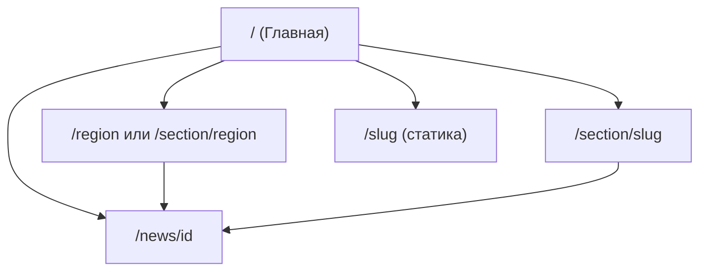

# Структура регионального новостного сайта: план на основе мировых практик

## 1. Итоги исследования

### Источники и выводы

- **Guardian**: мобильный приоритет (75% трафика с мобильных), «контейнерная» модель контента на главной и в разделах, персонализация «My Guardian», акцент на вовлечённость, а не только клики. Главная страница остаётся важной точкой входа.
- **NYT**: быстрая и гибкая главная, отдельные блоки/ленты под разный контент, дизайн под быстрые новостные циклы.
- **BBC News**: лента «Top Stories» с явной привязкой к региону («You are now seeing top stories for the UK»), табы разделов (Politics, UK, Business, World, Health, Science, Entertainment). Отдельная структура **UK Nations and Regions** — нация → регион → город (England → North West → Manchester и т.д.), возможность «Change my nation/region».
- **ABC News**: блоки «Top Stories», «Local News To You» (по локации), «Everyone's Talking About»; разделы U.S., Politics, Lifestyle, World, Elections.
- **Google News Initiative / исследования**: пользовательский опыт в центре; модульные, визуальные главные (фото + карточки) работают лучше «классических» текстовых; иерархия Homepage → Category → Article; хлебные крошки и семантика улучшают навигацию и SEO.
- **Региональные издания и SEO**: чёткая иерархия, консистентные URL, хлебные крошки, гео-таргет в Publisher Center, контент-кластеры по темам, внутренние ссылки с осмысленным анкором.

### Общие принципы для регионального сайта

- **Приоритет региона**: блок «Новости региона» на видном месте (как «Local News To You» / BBC Regions).
- **Главная как контейнер**: отдельные блоки — главное, регион, общие новости, разделы по темам (не одна общая лента).
- **Минимум кликов**: понятная навигация, разделы в шапке (без выбора региона — регион один на весь сайт).
- **Мобильный приоритет**: адаптивная вёрстка, бургер-меню, крупные зоны нажатия.
- **Иерархия и семантика**: Homepage → Раздел/Регион → Статья; breadcrumbs; семантичные `<nav>`, `<main>`, регионы.
- **Региональный SEO**: гео-метки, структурированные данные для локальных материалов.

---

## 2. Предлагаемая информационная архитектура

### Карта сайта (URL и назначение)

| URL                             | Назначение                                                              |
| ------------------------------- | ----------------------------------------------------------------------- |
| `/`                             | Главная: главное + регион + немного общих новостей                      |
| `/region` или `/section/region` | Все новости региона (регион фиксирован, выбор пользователем недоступен) |
| `/section/[slug]`               | Раздел по теме (политика, спорт и т.д.) — уже есть в проекте            |
| `/news/[id]`                    | Страница новости — уже есть                                             |
| `/[slug]`                       | Статические страницы (о нас, контакты и т.д.) — уже есть                |

Текущий бэкенд это поддерживает: [backend/src/modules/news/news.public.routes.js](backend/src/modules/news/news.public.routes.js) принимает `region`, `section`, пагинацию; [backend/prisma/schema.prisma](backend/prisma/schema.prisma) — `NewsItem.region`, `NewsItem.sectionId`, `Section`, `Menu`, `Page`.

### Структура главной страницы (блоки)

Рекомендуемый порядок сверху вниз:

1. **Шапка** — логотип, главное меню (Главная, Новости региона, разделы), опционально поиск. Выбор региона не предусмотрен. Уже реализовано в [frontend/layouts/default.vue](frontend/layouts/default.vue) через `GET /api/menus/header`.
2. **Хлебные крошки** — «Главная» на главной; на остальных страницах Главная → Раздел/Регион → [Статья].
3. **Блок «Главное» (Top Stories)** — 1–4 важных материала (регион + общие), один крупный + несколько карточек. Запрос к `GET /api/news` с приоритетом по дате и при желании по разделу/региону.
4. **Блок «Новости региона»** — заголовок «Новости [Название региона]», лента карточек с `region=<текущий_регион>`, ссылка «Все новости региона» на `/region` или `/section/region`. Тот же API с `region=...`.
5. **Блок «Общие новости»** — 3–5 материалов без региона или из раздела «Общее». API без `region` или `section=general`.
6. **Разделы по темам** — табы или горизонтальные блоки (Политика, Спорт, Происшествия, Культура и т.д.) с последними по каждому разделу; при клике — переход на `/section/[slug]`. Разделы из `GET /api/sections`, контент из `GET /api/news?section=...`.

Так главная становится «контейнером» из отдельных зон, а не одной плоской лентой — в духе Guardian/NYT/ABC.

### Рекомендуемый набор разделов (Section)

Настраиваются в админке; пример slug и названий:

| slug             | Название        |
| ---------------- | --------------- |
| `top` или `main` | Главное         |
| `region`         | Новости региона |
| `politics`       | Политика        |
| `society`        | Общество        |
| `incidents`      | Происшествия    |
| `sport`          | Спорт           |
| `culture`        | Культура        |
| `economy`        | Экономика       |
| `general`        | Общие новости   |

Меню в шапке: Главная (/) → Новости региона (/section/region или /region) → остальные разделы. Футер — статика и соцсети через [frontend/layouts/default.vue](frontend/layouts/default.vue) и `GET /api/menus/footer`.

### Необходимые статические страницы (Page)

Создавать в админке с указанным slug; контент (title, body) редактируется по необходимости. Рекомендуемый список:

| slug          | Название                    | Назначение                                                                              |
| ------------- | --------------------------- | --------------------------------------------------------------------------------------- |
| `about`       | О проекте / О нас           | Описание издания, миссия, история.                                                      |
| `contacts`    | Контакты                    | Адрес, телефон, email, форма обратной связи.                                            |
| `advertising` | Реклама                     | Условия размещения рекламы, контакты отдела рекламы.                                    |
| `privacy`     | Политика конфиденциальности | Обработка персональных данных, cookies (обязательно для соответствия законодательству). |
| `terms`       | Правила использования       | Условия использования сайта, ограничения, ответственность.                              |
| `editorial`   | Редакция                    | Состав редакции, контакты журналистов, как предложить новость.                          |
| `rss`         | RSS                         | Описание и ссылки на RSS-ленты (если выдаются пользователям).                           |

Минимально обязательные для типового регионального сайта: **О нас** (`about`), **Контакты** (`contacts`), **Политика конфиденциальности** (`privacy`). Остальные — по необходимости; пункты меню в header/footer настраиваются в админке и могут вести на эти slug через `/[slug]`.

### Регион: фиксированный, без выбора

Регион один на весь сайт, задаётся в конфигурации (env или runtimeConfig). Пользователь не может его изменить — переключателя региона в интерфейсе нет. На главной и в блоке «Новости региона» везде используется одно и то же значение `region` из конфига. Бэкенд менять не требуется — фильтр `region` уже есть.

---

## 3. Соответствие текущему коду

- **API**: [backend/src/modules/news/news.public.routes.js](backend/src/modules/news/news.public.routes.js) — `GET /api/news` с `region`, `section`, `dateFrom`, `dateTo`, `page`, `limit`; `GET /api/news/:id`. Этого достаточно для главной с блоками и для страницы региона.
- **Frontend**: [frontend/pages/index.vue](frontend/pages/index.vue) — сейчас одна лента; нужно разбить на блоки (главное, регион, общие, разделы) и при необходимости добавить страницу `/region` (или использовать раздел с slug `region`).
- **Layout**: меню и футер уже подтягиваются по ключам; достаточно настроить пункты меню в админке под новую структуру. Компонент выбора региона в header не добавлять.
- **Разделы и страницы**: [frontend/pages/section/[slug].vue](frontend/pages/section/[slug].vue) и [frontend/pages/[slug].vue](frontend/pages/[slug].vue) уже есть; изменений в маршрутах не требуется.

---

## 4. Рекомендуемые шаги внедрения

1. **Документация** — сохранить эту структуру в `.md` (например `docs/site-structure.md` или `docs/regional-news-structure.md`) для команды и дальнейшей реализации.
2. **Главная страница** — переработать [frontend/pages/index.vue](frontend/pages/index.vue): несколько блоков (Главное, Новости региона, Общие новости, разделы по темам), отдельные вызовы API с разными `region`/`section`; единый компонент карточки новости (вынести в `components/` при необходимости).
3. **Фиксированный регион** — задать регион в `runtimeConfig` (или env) один раз и использовать во всех запросах на главной и на странице раздела «Новости региона». Переключателя региона в UI не делать.
4. **Страница «Новости региона»** — использовать раздел с slug `region` и текущую страницу [frontend/pages/section/[slug].vue](frontend/pages/section/[slug].vue); в запросах передавать `region` из конфига (если API раздела поддерживает) или оставить вывод по sectionId.
5. **Хлебные крошки** — компонент breadcrumbs в layout или на страницах: главная → раздел/регион → статья.
6. **Настройка контента в админке** — создать/настроить разделы (Section) и пункты меню (Menus) по таблице выше; создать статические страницы из списка ниже; при необходимости seed для дефолтных разделов, меню и страниц.
7. **Мобильная навигация** — бургер-меню и адаптив шапки/футера в [frontend/layouts/default.vue](frontend/layouts/default.vue), если ещё не сделано.
8. **Пагинация / «Ещё»** — на главной в блоках и на страницах разделов/региона использовать `total` и параметры `page`/`limit` из API.

Реализацию можно разбить на этапы: сначала главная с блоками и фиксированный регион, затем статические страницы и пункты меню, затем breadcrumbs и полировка мобильной навигации.