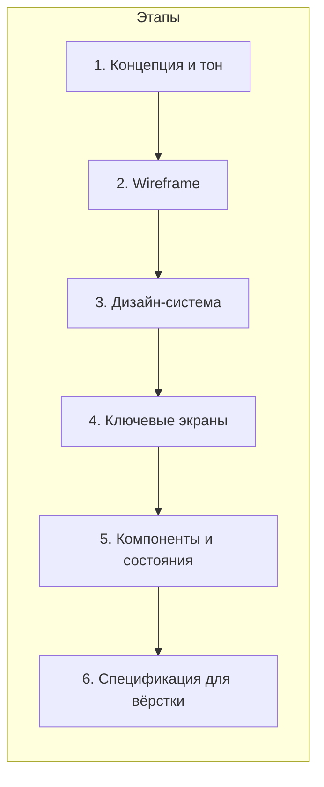

# План разработки дизайна сайта агрегатора новостей

## Исходные требования из планов

Из [regional_news_site_structure_ee30e914.plan.md](.cursor/plans/regional_news_site_structure_ee30e914.plan.md) и [news_aggregator_web_app_3b752922.plan.md](.cursor/plans/news_aggregator_web_app_3b752922.plan.md) следует:

- **Тип сайта:** региональный новостной агрегатор (один фиксированный регион, без переключателя).
- **Главная:** контейнер из блоков — шапка, хлебные крошки, «Главное» (Top Stories), «Новости региона», «Общие новости», разделы по темам (табы/карточки).
- **Страницы:** главная `/`, раздел `/section/[slug]`, новость `/news/[id]`, статика `/[slug]` (about, contacts, privacy и т.д.).
- **Приоритеты:** мобильный первый (75% трафика по практикам Guardian), понятная навигация, семантика и SEO, единый компонент карточки новости.
- **Текущий фронт:** Nuxt 3, [frontend/layouts/default.vue](frontend/layouts/default.vue) — шапка, меню, футер; [frontend/pages/index.vue](frontend/pages/index.vue) — одна лента (предстоит разбить на блоки).

Дизайн должен поддерживать эту структуру и быть готов к переносу в Nuxt/Vue (компоненты, отступы, типографика, цвета).

---

## Выбор инструмента: качество и стоимость

Краткое сравнение AI-инструментов для полного цикла дизайна (wireframe → визуал → компоненты):


| Критерий              | Figma + Figma AI (Make)       | v0 (Vercel)                | Uizard                       | Framer AI          |
| --------------------- | ----------------------------- | -------------------------- | ---------------------------- | ------------------ |
| Стоимость             | Бесплатный тариф              | 200 кредитов/мес бесплатно | 3 AI-генерации/мес бесплатно | Бесплатный тариф   |
| Результат             | Макеты в Figma, экспорт       | React/Tailwind код         | UI-макеты, экспорт           | Готовый живой сайт |
| Стек проекта          | —                             | React (не Nuxt/Vue)        | —                            | Свой хостинг       |
| Интеграция с проектом | Figma MCP → реализация в Nuxt | Только как референс        | Референс                     | Отдельный продукт  |


**Рекомендация: Figma + Figma AI (Make)** как основной инструмент.

- **Почему:** бесплатный тариф без жёсткого лимита на файлы и рамки; индустриальный стандарт; у вас уже есть Figma MCP и навык [Implement Design](file:///Users/MacBook/.cursor/skills/implement-design/SKILL.md) — дизайн из Figma можно перенести в Nuxt с 1:1 соответствием.
- **Ограничение:** генерация через Figma Make может быть платной в части функций — тогда wireframe и визуал делаются вручную в Figma по промптам ниже; AI используется выборочно (например, только для карточек и блоков).
- **Альтернатива по шагам:** быстрые wireframe/мокапы — [Google Stitch](https://stitch.google/) (до 350 генераций в месяц бесплатно, экспорт HTML/CSS); для генерации кода как референса — **v0** (бесплатный тариф), с последующим портированием идей в Vue/Nuxt.

В плане ниже этапы описаны так, чтобы их можно было выполнить в **Figma (ручной + AI по возможности)** с минимальными затратами.

---

## Этапы разработки дизайна и туду-лист




### Этап 1. Концепция и тон (moodboard, референсы)

**Цель:** зафиксировать визуальный тон (серьёзный новостной, но не мрачный), референсы и ограничения.

**Задачи:**

- Собрать референсы: главные BBC News, Guardian, NYT, ABC; один региональный сайт (по желанию).
- Создать moodboard в Figma (1 фрейм): скриншоты шапок, карточек, типографики, цветовые пятна.
- Записать решение: светлая/тёмная/смешанная тема, основной и акцентный цвет, шрифты (например, один для заголовков, один для тела).

**Промт для Figma AI / текстовый бриф для себя:**

```
Moodboard для регионального новостного сайта. Стиль: доверительный, читаемый, мобильный приоритет. Референсы: BBC News, The Guardian — чистые блоки, чёткая иерархия, карточки с изображением и заголовком. Нужны примеры: шапка с логотипом и навигацией, карточка новости (изображение, заголовок, дата), блок «главное» с одним крупным и 2–3 меньшими. Цвета: нейтральный фон, тёмный текст, один акцентный цвет для ссылок и кнопок. Никакого игрового или развлекательного стиля.
```

**Итог этапа:** один файл Figma с moodboard и короткий документ (или комментарии в Figma): «Тон: …, тема: светлая/тёмная, шрифты: …, основной цвет: …, акцент: …».

---

### Этап 2. Wireframe главной и типовых страниц

**Цель:** зафиксировать структуру и приоритет контента без деталей визуала.

**Задачи:**

- Wireframe **главной** (desktop + mobile): шапка, хлебные крошки, блок «Главное» (1 крупный + 2–3 карточки), блок «Новости региона», блок «Общие новости», разделы по темам (табы или ряд карточек), футер.
- Wireframe **страницы раздела** (например `/section/politics`): заголовок раздела, список карточек новостей, пагинация или «Ещё».
- Wireframe **страницы новости**: заголовок, мета (дата, источник), изображение, тело текста, возможно блок «Ещё по теме».
- Wireframe **статической страницы** (например контакты): заголовок, контент в одну колонку.

**Промт для генерации wireframe (Figma Make / Uizard / Google Stitch):**

```
Wireframe главной страницы регионального новостного сайта. Сверху вниз: шапка с логотипом слева и горизонтальное меню (Главная, Новости региона, Политика, Спорт, Общество). Под меню — хлебные крошки «Главная». Блок «Главное»: слева один большой прямоугольник под изображение+заголовок, справа 3 маленьких карточки. Дальше блок «Новости региона» — заголовок и 4 карточки в ряд (изображение, заголовок, дата). Потом блок «Общие новости» — 3–4 карточки. Потом горизонтальные табы разделов (Политика, Спорт, Культура…) с карточками под каждым. Внизу футер с ссылками. Стиль: только контуры и подписи, без цветов и декора. Мобильная версия: та же структура, один столбец, бургер-меню в шапке.
```

**Итог этапа:** в Figma — 4–6 фреймов wireframe (главная desktop/mobile, раздел, новость, статика) с подписями блоков.

---

### Этап 3. Дизайн-система (цвета, типографика, сетка)

**Цель:** один набор токенов для всего интерфейса.

**Задачи:**

- Цвета: фон (страница, карточки), текст (основной, вторичный), ссылки, акцент, границы, ошибки (если нужны).
- Типографика: шрифт заголовков (H1–H4), шрифт тела, размеры и межбуквенное/межстрочное для mobile/desktop.
- Сетка: колонки (например 12), отступы (8px база), максимальная ширина контента (например 1200px).
- Тени и скругления (карточки, кнопки) — минимально.

**Промт для генерации палитры/типографики (Figma Make или описание для ручного ввода):**

```
Design tokens for a regional news website. Light theme: page background #f5f5f5, card background #ffffff, primary text #1a1a1a, secondary text #666666, link and accent #0066cc, border #e0e0e0. Font: system or one serif for headings (e.g. Georgia or PT Serif), one sans for body (e.g. system-ui or Open Sans). Heading sizes: H1 28px mobile / 36px desktop, H2 22/28, H3 18/22, body 16px, line-height 1.5. Spacing base 8px. Card border-radius 8px, subtle shadow. Create a simple Figma frame with color swatches and type scale.
```

**Итог этапа:** в Figma — страница «Design system» с палитрой, типографикой и сеткой (можно как локальные стили и переменные).

---

### Этап 4. Визуальный дизайн ключевых экранов

**Цель:** применить дизайн-систему к главной, разделу и странице новости.

**Задачи:**

- Нарисовать в Figma **главную** по утверждённому wireframe: реальные цвета, шрифты, изображения-плейсхолдеры, отступы по сетке.
- То же для **страницы раздела** и **страницы новости**.
- Проверить мобильные варианты (адаптивные фреймы или отдельные артборды).

**Промт для генерации блока или экрана (Figma Make / описание для ручной отрисовки):**

```
News website homepage section. «Top stories» block: one large card on the left (image 16:9, headline, date, category tag), three smaller cards on the right (small image, headline, date). Cards have white background, 8px radius, light shadow. Below: section title «Новости региона» and a row of 4 news cards — image on top, title, date, 2 lines max for title. Use colors: background #f5f5f5, text #1a1a1a, secondary #666, accent #0066cc. Clean, readable, no decorative graphics.
```

**Итог этапа:** 3–6 высокодетализированных фреймов (главная, раздел, новость × desktop/mobile).

---

### Этап 5. Компоненты и состояния

**Цель:** переиспользуемые компоненты и их состояния для передачи в вёрстку.

**Задачи:**

- Компоненты в Figma: **Карточка новости** (с изображением, без, только текст), **Шапка** (десктоп/мобильная с бургером), **Футер**, **Хлебные крошки**, **Кнопка** (primary/secondary), **Таб разделов**, **Пагинация**.
- Для каждого: состояния (default, hover, focus при необходимости).

**Промт для карточки новости:**

```
News card component for a news aggregator. Variant 1: large — image 16:9 on top, category label above image, headline (2 lines), summary 2 lines, date and source below. Variant 2: small — small square image left, headline 2 lines, date. Variant 3: text-only — headline, date, 1 line summary. White card, 8px radius, shadow on hover. Typography and colors from design system. Create both default and hover state.
```

**Итог этапа:** библиотека компонентов в Figma с вариантами и состояниями.

---

### Этап 6. Спецификация для разработки (handoff)

**Цель:** чтобы реализация в Nuxt (по плану regional structure) была однозначной.

**Задачи:**

- Убедиться, что у ключевых экранов и компонентов заданы отступы, размеры шрифтов, цвета (через стили/переменные).
- Экспорт или описание: какие изображения (пропорции, плейсхолдеры), какие breakpoints (например 768px, 1024px).
- Краткий handoff-документ: ссылка на Figma, перечень страниц и компонентов, решение по мобильному меню (бургер, раскрытие), примечания по анимациям (если есть).

**Промт для самопроверки:**

```
Checklist for developer handoff: (1) All text uses design system font and size. (2) Spacing between sections is consistent (e.g. 24px or 32px). (3) Clickable areas have clear hover state. (4) Mobile breakpoint: navigation collapses to hamburger, cards stack in one column, «Top stories» becomes one column. (5) Breadcrumbs and footer links are clearly defined. Document any exception.
```

**Итог этапа:** аккуратный Figma-файл + короткий markdown с пунктами выше и ссылкой на макеты.

---

## Сводка: туду-лист и инструменты по этапам


| Этап | Задача                                                            | Инструмент                     | Промт/инструкция                                        |
| ---- | ----------------------------------------------------------------- | ------------------------------ | ------------------------------------------------------- |
| 1    | Концепция, moodboard, тон                                         | Figma                          | Промт на moodboard выше                                 |
| 2    | Wireframe главной, раздела, новости, статики                      | Figma / Uizard / Google Stitch | Промт на wireframe главной и описание остальных экранов |
| 3    | Дизайн-система (цвета, типографика, сетка)                        | Figma                          | Промт на design tokens                                  |
| 4    | Визуальный дизайн ключевых экранов                                | Figma                          | Промт на блок «Top stories» и «Новости региона»         |
| 5    | Компоненты (карточка, шапка, футер, хлебные крошки, кнопка, табы) | Figma                          | Промт на карточку новости и аналоги для остальных       |
| 6    | Спецификация и handoff                                            | Figma + MD                     | Чеклист и handoff-документ                              |


**Рекомендуемый основной инструмент:** **Figma** (бесплатно) + по возможности **Figma AI (Make)** или **Google Stitch** для ускорения wireframe и блоков. После утверждения дизайна — перенос в Nuxt по плану структуры с использованием Figma MCP и навыка Implement Design.

---

## Промты по этапам (сводка для копирования)

**Этап 1 — Moodboard:**  
*См. блок «Промт для Figma AI / текстовый бриф» в Этапе 1.*

**Этап 2 — Wireframe главной:**  
*См. блок «Промт для генерации wireframe» в Этапе 2.*

**Этап 2 — Остальные экраны:** описать те же блоки для «Страница раздела» (заголовок + список карточек + пагинация), «Страница новости» (заголовок, мета, изображение, тело), «Статическая страница» (заголовок, одна колонка текста).

**Этап 3 — Design tokens:**  
*См. блок «Промт для генерации палитры/типографики» в Этапе 3.*

**Этап 4 — Блоки главной:**  
*См. блок «Промт для генерации блока или экрана» в Этапе 4.*

**Этап 5 — Карточка новости:**  
*См. блок «Промт для карточки новости» в Этапе 5.*

**Этап 6 — Handoff:**  
*См. блок «Промт для самопроверки» в Этапе 6.*

При необходимости можно сузить или расширить этапы (например, объединить 3 и 4 или вынести мобильные макеты в отдельный подэтап).