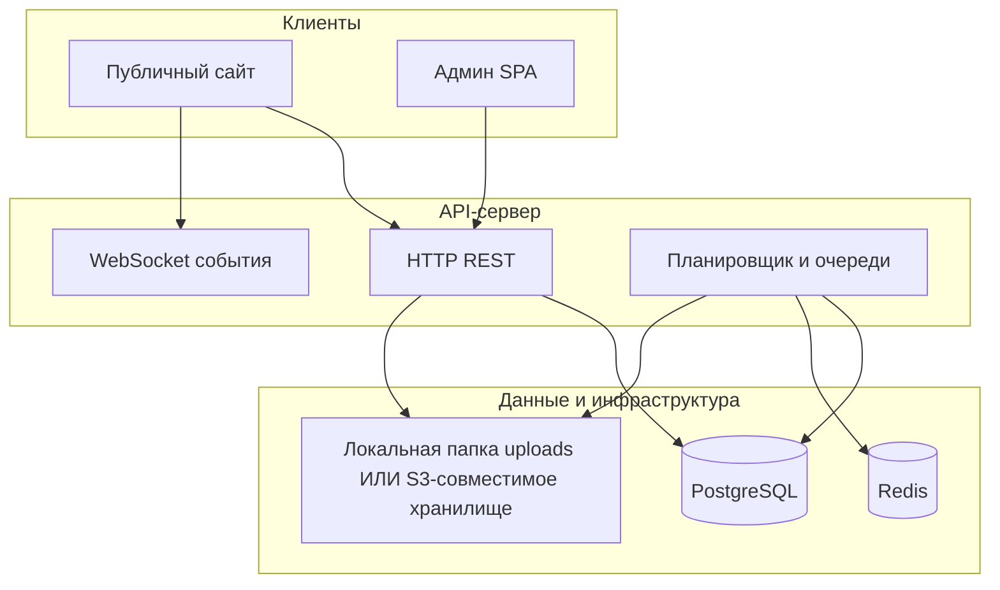

# SPEC — спецификация системы «News Aggregator»

Документ описывает **логическую архитектуру**, **доменную модель**, **контракты API** и **потоки данных** независимо от конкретного фреймворка. Его можно использовать для воссоздания проекта на другом стеке (например: FastAPI + React + Next.js, или Go + htmx).

---

## 1. Назначение и границы

**Продукт:** региональный новостной агрегатор с ручной модерацией: импорт из RSS/сайтмапов, хранение материалов, юридически-ориентированные правила источников, ИИ-помощь редакторам, публичный сайт и отдельная админ-панель.

**Вне системы (по умолчанию):** платежи, комментарии читателей, многоарендность, произвольная геолокация пользователей.

**Три клиентских приложения:**

| Клиент | Роль |
|--------|------|
| Публичный сайт | Чтение опубликованных новостей, разделов, меню, статических страниц; подписка на обновления в реальном времени. |
| Админ-панель | Авторизация, CRUD контента, настройки, источники, роли/пользователи. |
| API-сервер | Единая точка данных, фоновые задачи, WebSocket. |

---

## 2. Логическая архитектура



**Инфраструктурные зависимости:**

- **PostgreSQL** — основное хранилище (пользователи, новости, источники, настройки в JSON и т.д.).
- **Redis** — брокер очередей Bull-совместимый по смыслу: задачи «опрос RSS», «парсинг статьи», «очистка устаревших черновиков». Без Redis планировщик и очереди не поднимаются (в коде предусмотрено мягкое отключение).
- **Объектное хранилище или диск** — изображения обложек и общие загрузки; URL в БД должны быть доступны браузеру (прямой S3/MinIO или прокси через nginx).

---

## 3. Эквиваленты при переносе на другой стек

| Текущая реализация | Логический эквивалент |
|--------------------|------------------------|
| Express.js | Любой HTTP-фреймворк с маршрутизацией и middleware. |
| Prisma + PostgreSQL | Любой ORM/SQL с той же схемой таблиц и ограничений. |
| JWT в cookie `admin_session` + опционально `Authorization: Bearer` | Сессия редактора: либо cookie HttpOnly, либо Bearer-only — главное единообразие с CORS `credentials`. |
| Bull + Redis | Очередь задач (Sidekiq, Celery, pg-boss, Cloud Tasks) с cron-триггерами. |
| Socket.io | WebSocket/SSE с теми же именами событий и JSON payload. |
| Nuxt 3 SSR/SSG | Любой SSR/SSG или чистый SPA, потребляющий тот же REST + WS. |
| Vue 3 + Vite админка | Любой SPA с роутингом и хранением сессии через cookie к API. |

---

## 4. Доменная модель (концептуально)

### 4.1. Пользователи и доступ

- **Permission** — атомарное право (`code`: строка-идентификатор).
- **AuthRole** — роль: `slug`, `name`, флаг **полного доступа** `isFullAccess`. Если `isFullAccess = true`, проверки по списку разрешений не применяются.
- **RolePermission** — связь многие-ко-многим роль ↔ разрешение.
- **User** — email, хеш пароля (bcrypt-совместимый по смыслу), ссылка на роль.

**Стандартные коды разрешений (из сида):** `news`, `pages`, `sections`, `menus`, `sources`, `users`, `roles`, `settings`.

### 4.2. Контент

- **Section** — раздел сайта: `slug`, `title`, порядок, видимость.
- **NewsItem** — материал:
  - привязка к **Source** и опционально к **Section**;
  - `status`: `PENDING` | `PUBLISHED` | `REJECTED` | `MERGED`;
  - `mergedIntoId` — если задан, запись считается поглощённой дубликатом и **не показывается** в публичных списках;
  - `title`, `titleNormalized` (для поиска дубликатов), `summary`, `body`, `url`, `imageUrl`, `region`, даты публикации в системе и в источнике;
  - JSON-поля: `sourceSnapshots`, `confirmedFacts`, `differences` (обзорная/агрегированная подача);
  - `contentClass`: `NEWS` | `REPORT` | `ANALYSIS` | `OPINION` | `UNKNOWN`;
  - `legalReviewStatus` / `legalReviewNotes` — юридический контур перед публикацией.
- **NewsItemHistory** — снимки изменений (JSON snapshot).
- **NewsItemFactCheck** — результаты ИИ-проверки фактов.

### 4.3. Источники

- **Source** — тип (`rss` и т.д.), URL, имя, `params` (JSON), активность, время последнего опроса.
- **SourceFilter** — правила INCLUDE/EXCLUDE по полям (`title`, `content`, …) с операторами (`contains`, `regex`, …).
- **SourceUsageRule** — правила переиспользования контента (цитирование, атрибуция, запрет дословного копирования, обязательная ссылка, класс материала по умолчанию и др.) — один к одному с источником.

### 4.4. Навигация и страницы

- **Menu** — ключ (`header`, `footer`, …), имя.
- **MenuItem** — иерархия через `parentId`, ссылка или привязка к разделу.

- **Page** — статическая страница: `slug`, `title`, HTML `body`, порядок, видимость.

### 4.5. Настройки приложения

- **Setting** — key-value в БД: `key` уникален, `value` — JSON. Используется для AI, общих флагов, регионов, хранилища и т.д. (конкретные ключи реализованы в сервисе настроек backend).

---

## 5. Зависимости между модулями backend (логические)

```
config (env, prisma client)
    ↑
auth (JWT, bcrypt, middleware requireAuth / requirePermission)
    ↑
все /api/admin/* маршруты (кроме части публичных)

services/
  ai.js          ← config, Prisma (новости, источники)
  articleParser  ← очередь парсинга, enrichNewsItem
  newsMerge      ← Prisma, AI при объединении дубликатов
  legalCompliance← правила источников + текст новости
  storage / s3   ← загрузки, публичные URL
  settings       ← таблица Setting

jobs/
  queue.js       ← Redis, Bull-семантика
  fetchRss.js    ← Parser RSS, sitemap, фильтры, создание NewsItem
  cleanupStaleNews ← Prisma

ws.js            ← Socket.io, события публикации (импортируется из news-роутов и очереди)
```

**Правило маршрутизации Express:** для `/api/admin/news` сначала подключаются маршруты с префиксами вроде `/ai/...`, затем общие `/:id`, чтобы не перехватывать специальные пути.

---

## 6. Основные потоки данных

### 6.1. Импорт RSS / сайтмапа

1. По расписанию (например каждые **15 минут**) запускается задача «опрос источников».
2. Для каждого активного **Source** загружается лента или список URL из сайтмапа.
3. Элементы прогоняются через **SourceFilter**; подходящие создают **NewsItem** со статусом `PENDING` (и дедупликация по паре `sourceId` + `externalId`).
4. Опционально: нормализация заголовка (ИИ), парсинг полного текста по URL (синхронно или через очередь **article-parse**), обогащение полей.

### 6.2. Редактирование и публикация

1. Редактор через админку меняет поля новости; при существенном изменении текста сбрасывается юридический статус в `PENDING` (логика в коде).
2. **PATCH статуса** в `PUBLISHED`: сервер запускает **legal compliance** по тексту и правилам источников из снимков; при блокирующем результате — отказ с кодом/текстом ошибки.
3. При успешной публикации выставляется `publishedAt`, в историю пишется снимок; в **WebSocket** уходит событие `news:published`.
4. При обновлении уже опубликованной новости — событие `news:updated` (и после фонового парсинга тела — аналогично).

### 6.3. Объединение дубликатов

- Отдельный админ-эндпоинт запускает пакетное слияние (зависит от настроек «объединение дубликатов» и наличия AI-ключа). Материалы помечаются `MERGED`, целевая новость агрегирует данные в JSON-полях.

### 6.4. Очистка черновиков

- По расписанию (например **каждый час**) задача удаляет устаревшие неопубликованные материалы, если включено в общих настройках.

### 6.5. Публичный сайт и реалтайм

- Списки и карточки читают только `status = PUBLISHED` и `mergedIntoId IS NULL`.
- Клиент подключается к тому же хосту API (или прокси), путь Socket.io по умолчанию `/socket.io`, события: `news:published`, `news:updated` с payload в форме «как публичный GET новости по id» (плюс переписанный публичный URL картинки при S3).

---

## 7. HTTP API

Общие правила:

- JSON в теле запросов/ответов, кроме загрузки файлов (`multipart/form-data`).
- Ошибки: по возможности `{ "error": "..." }`, иногда `details` для Zod.
- Админ: **JWT** в cookie `admin_session` **или** заголовок `Authorization: Bearer <token>`. Логин выставляет cookie; клиент админки использует `credentials: 'include'`.
- CORS: список origin из переменной окружения; для креденшелов нужен явный origin.

### 7.1. Публичные эндпоинты (без JWT)

| Метод | Путь | Назначение |
|-------|------|------------|
| GET | `/api/health` | `{ ok: true }` |
| GET | `/api/news` | Список опубликованных новостей. Query: `region`, `noRegion`, `section` (id раздела), `dateFrom`, `dateTo`, `page`, `limit` (макс. 100). Ответ: `{ items, total }`. |
| GET | `/api/news/:id` | Одна новость по **id** или **externalId**; если запись merged — редирект на канонический id; только `PUBLISHED`. |
| GET | `/api/sections` | Список разделов. |
| GET | `/api/menus` | Краткий список меню. |
| GET | `/api/menus/:key` | Меню с деревом пунктов (корневые + children). |
| GET | `/api/pages` | Видимые страницы (slug, title, order). |
| GET | `/api/pages/:slug` | Одна видимая страница. |
| GET | `/api/regions` | Список регионов из настроек (для UI). |
| GET | `/uploads/*` | Статика локальных файлов (если не S3). |

### 7.2. Аутентификация

| Метод | Путь | Тело / ответ |
|-------|------|----------------|
| POST | `/api/auth/login` | `{ email, password }` → `{ user: { id, email, role, roleId, roleSlug, isFullAccess?, permissions? } }` + Set-Cookie |
| GET | `/api/auth/me` | Текущий пользователь (нужен JWT). |
| POST | `/api/auth/logout` | Сброс cookie, 204. |

### 7.3. Админ: новости (`permission: news`)

Базовый префикс: `/api/admin/news`.

| Метод | Путь | Описание |
|-------|------|----------|
| POST | `/ai/edit` | ИИ: действия `improve`, `shorten`, `expand`, `generate-title`, `generate-summary`, `rewrite-copyright-safe`, `generate-overview`, `legal-precheck` — см. тело в реализации (нужны `newsId`, `text`, `action`, опционально `field`). |
| POST | `/ai/generate-cover` | Генерация превью обложки по тексту. |
| POST | `/:id/cover` | Загрузка файла обложки (`image`). |
| POST | `/:id/fact-check` | ИИ fact-check, запись в `NewsItemFactCheck`. |
| GET | `/` | Список с фильтрами: `status`, `sectionId`, `region`, `contentClass`, `legalReviewStatus`, `page`, `limit`, `sort` (`createdAt` или по умолчанию дата источника). |
| POST | `/merge-duplicates` | Запуск пакетного слияния дубликатов. |
| GET | `/:id` | Одна новость (включая mergedInto). |
| GET | `/:id/history` | История версий. |
| POST | `/` | Создание (опционально `sourceId`, иначе источник «Ручной ввод» из сида). |
| PUT | `/:id` | Обновление полей + история. |
| PATCH | `/:id/status` | `{ status: PENDING \| PUBLISHED \| REJECTED }` — при PUBLISHED проверки legal + `publishedAt`. |
| DELETE | `/:id` | Удаление. |
| POST | `/:id/parse-body` | Очередь или синхронный парсинг полного текста по URL новости. |
| POST | `/parse-test` | `{ url }` — тест парсера без сохранения. |

### 7.4. Админ: разделы (`sections`)

`/api/admin/sections` — CRUD: GET `/`, GET `/:id`, POST `/`, PUT `/:id`, DELETE `/:id`.

### 7.5. Админ: меню (`menus`)

`/api/admin/menus` — CRUD меню и пунктов: в т.ч. GET `/:id/items`, POST `/:id/items`, PUT `/:menuId/items/:itemId`, DELETE `/:menuId/items/:itemId`.

### 7.6. Админ: страницы (`pages`)

`/api/admin/pages` — CRUD по аналогии с разделами.

### 7.7. Админ: источники (`sources`)

`/api/admin/sources` — CRUD источников, фильтров, правил использования; `POST /:id/fetch` — ручной опрос; `POST /ai/generate-usage-rule` — генерация правил из текста.

### 7.8. Админ: загрузки (`settings`)

`/api/admin/upload` POST, multipart поле `image`, permission **`settings`** (общие изображения, не только обложка новости).

### 7.9. Админ: настройки (`settings`)

`/api/admin/settings` — подресурсы: `general`, `storage`, `regions`, `ai`, `ai-image`, тест AI `POST /ai/test`. Все под `permission: settings`.

### 7.10. Админ: роли и пользователи

- `/api/admin/permissions` — GET список разрешений.
- `/api/admin/roles` — CRUD ролей, GET `/permissions` внутри роутера ролей для формы.
- `/api/admin/users` — CRUD пользователей (`users` permission).

---

## 8. WebSocket (Socket.io-совместимая семантика)

- Путь: **`/socket.io`** (стандартный для Socket.io).
- События сервера → клиента:
  - **`news:published`** — после перевода в `PUBLISHED`.
  - **`news:updated`** — после правки опубликованной новости или обогащения контента.
- Payload: объект `{ item: { id, title, summary, body, url, imageUrl, region, publishedAt, sourcePublishedAt, sectionId, section?, source? } }` с публичными URL изображений.

---

## 9. Клиент: публичный сайт (Nuxt)

**Маршруты страниц (файловый роутинг):**

- `/` — главная (топ, регион, разделы).
- `/section/[slug]` — лента раздела.
- `/news/[id]` — материал.
- `/[slug]` — статическая страница из CMS при отсутствии конфликта с зарезервированными путями.
- Дополнительные статические страницы проекта (`about`, `editorial`, …) — по репозиторию.

**Конфигурация:** публичный `apiBase` и имя региона через переменные окружения; для SSR к бекенду — отдельный внутренний базовый URL в Docker.

**Реалтайм:** composable подключает socket.io-client к origin API и на событиях вызывает обновление кэша данных Nuxt (`refreshNuxtData` для ключей списков и карточки новости).

**Sitemap:** серверный маршрут генерирует XML (новости + секции + статические пути).

---

## 10. Клиент: админ-панель (Vue SPA)

**Роутинг:** после логина — разделы по правам: новости, источники, разделы, меню, страницы, настройки (вложенные: общие, AI, хранилище, регионы, пользователи, роли).

**Доступ:** `router.beforeEach` проверяет `auth.fetchMe()` и `meta.permission` против `user.permissions` или `isFullAccess`.

---

## 11. Переменные окружения (логический минимум)

| Переменная | Назначение |
|------------|------------|
| `DATABASE_URL` | PostgreSQL connection string. |
| `PORT` | Порт HTTP API. |
| `JWT_SECRET` | Обязателен в production. |
| `JWT_EXPIRES_IN` | Срок жизни токена (строка вида `7d`). |
| `REDIS_URL` | Очереди и cron-задачи. |
| `CORS_ORIGINS` | Список origin через запятую. |
| `AI_PROVIDER` | `openai` или `zai` (или аналог в переносе). |
| `OPENAI_API_KEY` / `ZAI_API_KEY` | Ключи провайдера. |
| `S3_*`, `AWS_*`, `S3_PUBLIC_BASE_URL` | Опционально: объектное хранилище; иначе локальная папка `uploads`. |
| `NUXT_PUBLIC_API_BASE` / `VITE_API_BASE_URL` | URL API для браузера. |
| `NUXT_API_BASE_SERVER` | URL API для SSR Nuxt из контейнера. |
| `NUXT_PUBLIC_REGION` | Регион по умолчанию для сидов/настроек. |

---

## 12. Фоновые задачи и расписание (референс)

| Очередь / задача | Расписание (как в коде) | Назначение |
|------------------|-------------------------|------------|
| `rss-fetch` | `*/15 * * * *` | Опрос RSS/сайтмапов. |
| `article-parse` | по требованию | Полный текст по URL. |
| `news-cleanup` | `0 * * * *` | Удаление устаревших неопубликованных (если включено). |

---

## 13. Ключевые технические решения (для переноса)

1. **Единая модель новости** с ветвлением по `status` и `mergedIntoId` вместо отдельной таблицы «черновики».
2. **Правила источника** (отдельная сущность) + **юридическая проверка** перед публикацией на сервере, не только в UI.
3. **История изменений** append-only JSON snapshots.
4. **Идемпотентность импорта** через уникальный ключ `(sourceId, externalId)`.
5. **Публичные URL медиа** — абсолютные или относительные пути, с переписыванием для браузера при S3.
6. **RBAC** через роли с флагом полного доступа и явными кодами разрешений.
7. **Настройки приложения** в БД (JSON), а не только env — для оперативных флагов без редеплоя.

---

## 14. Зависимости npm-воркспейса (референс версий)

Монорепозиторий: корневой `package.json` с `workspaces: ["backend", "frontend", "admin"]`. Фактические версии пакетов смотреть в `backend/package.json`, `frontend/package.json`, `admin/package.json`.

---

*Документ отражает состояние кодовой базы на момент составления; при изменении маршрутов или схемы БД обновляйте соответствующие разделы.*
